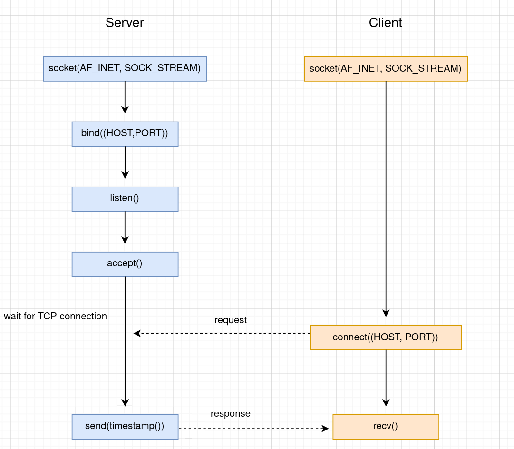
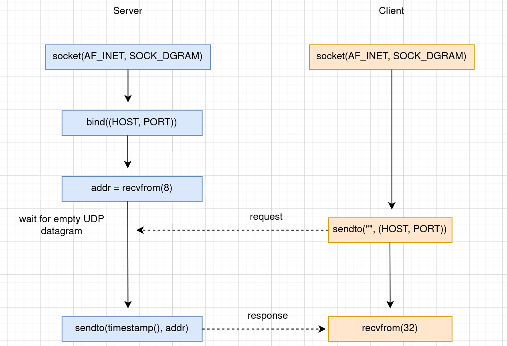
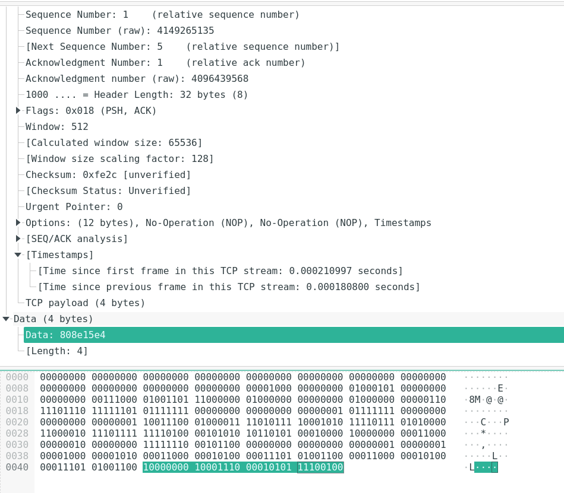
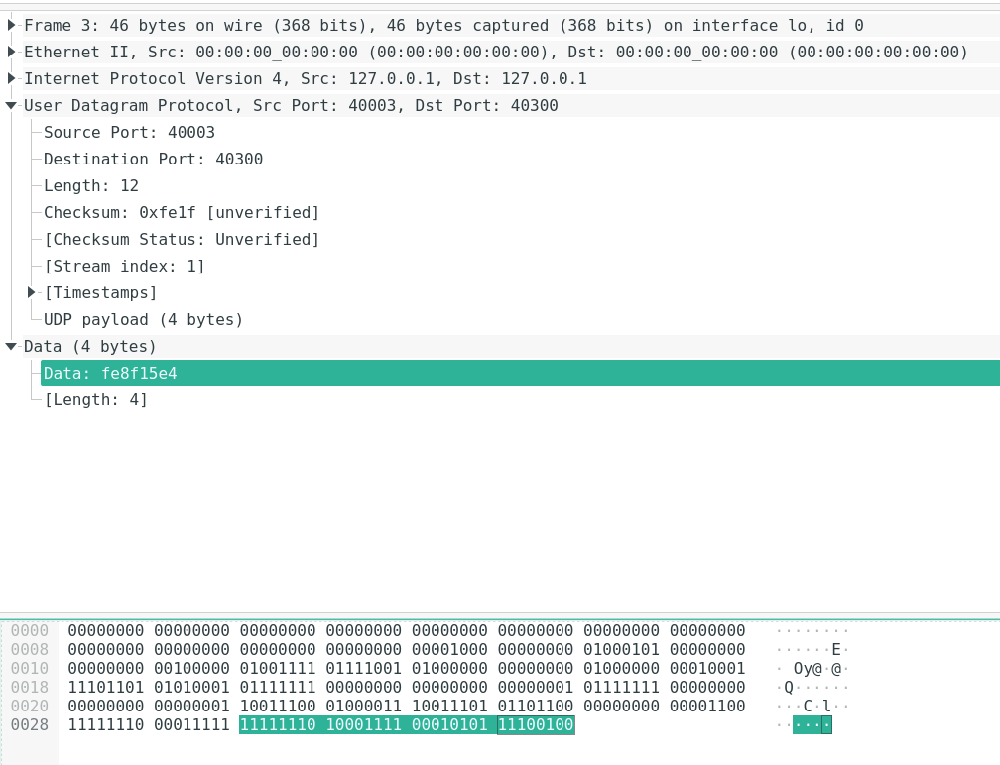
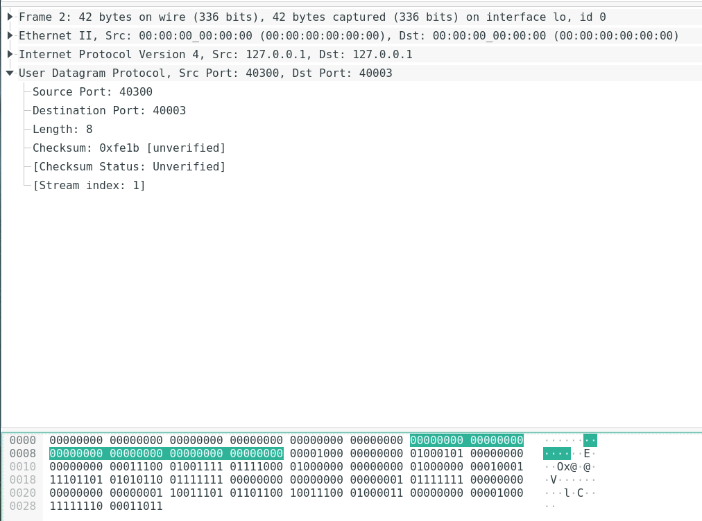

# Workshop 3 - Assignment: Time Protocol with Network Sockets

### Kristoffer Plagborg Bak Sørensen, 201908140
### Pernille Sonne Pallesen, 201909457

### Introduction

Link to git repository containing source code [computer_networks_workshop_3](https://github.com/Kristoffer-PBS/computer-networks_workshop_3)


This short document is made for [Workshop 3](https://github.com/rhjacobsen/CN_workshops/tree/master/Workshops/3) in Computernetworking. The workshop is about implementing a client and a server for the Time Protocol specified in [RFC 868](https://tools.ietf.org/html/rfc868).

The optional part of the workshop has not been made.

The client and server can be run on Linux machines, and are implemented for the UDP-based services and the TCP-based services. Both implementations are written in Python and make use of the socket API.


### How to compile and use the programs

<!-- Description of how to compile (if applicable) and use the programs. Remember to set the appropriate permission on the files. -->

The four python scrips have an added "shebang" `#! /usr/bin/env python3` at the top of the document, such that the programs can be invoked by `./tp<PROTOCOL><client|server>`, where `PROTOCOL` can be either `tcp` or `udp`. All 4 files have their user execution bit set, but if for some reason you are not able to execute the scripts after downloading the repository, then you can set them by using the `chmod` program e.g. `chmod u+x tptcpserver`. If you have a different way of starting the python3 interpreter you can simply remove these lines, and use you own preferred method e.g. `python3 tp<PROTOCOL><client|server>`. Both the UDP and TCP server will default to create and bind a socket on `"127.0.0.1:7890"`, and the both the clients will default to use `"127.0.0.1:7890"` to create a connection. These options can be changed and set by the user, by invoking the programs with respective flags e.g. `./tpudpclient --serverhost 192.168.0.2 --port 42069`. Call each script with `--help` or look at the source code, for how to set options. 


### Implementation

<!-- A short overall description of how the implementation has been structured -->

<!-- A description of how the socket API is used in the implementation. -->


#### Sequence diagram of TCP implementation



#### Sequence diagram of UDP implementation



In both versions the socket API is used to create an object at the application level to facilitate
network communication. The actual communication is handled by the operating system, and the sockets are an abstraction used for bidirectional communication.

<!-- A description of how it has been ensured that the implementation conforms to the protocol standard as described in RFC 868, including a documentation of the conformance testing described in the previous section.
i.e. "Use Wireshark to identify the exchange of timestamps between the server and the client. Is the payload size in the packet 32 bit (4 bytes) as specified in RFC 868?"-->

Our implementation does not fully conform to the protocol specifed in [RFC 868](https://tools.ietf.org/html/rfc868). In the RFC port 37 is specified, but we have made the port configurable such that port numbers higher than 1023 freely can be used. This is to ensure that anyone testing the program will not face any issue with using a permission restricted port number. 

Second the RFC specify that the size of the payload i.e. the timestamp should be 32 bits/4 bytes. We have used Wireshark to capture packets sent between the client and server application to verify this. A screenshot of the TCP- and UDP packets respectively are shown below. For both of them the payload size is 4 bytes as the protocol requires.




Third in the UDP implementation the client signals a request by sending an empty UDP datagram. The Wireshark capture of this is shown below:



Regarding how the timestamp is calculated we have used the unix epoch time, and a known time offset between
midnight January 1 1900 and midnight January 1 1970, where the Unix Epoch begins. Knowing this the time since midnight January 1 1900 and today, can be calculated as the sum of the time offset and the current unix epoch time. 

```python
    import time # the time method of the time module return the unix epoch time
    time_offset = 2_208_988_800
    UDP_868_timstamp = time_offset + time.time()
```

Using this mehtod to calculate the time is a bit of a simplification, as in the unix epoch time 
specification every day has 86400 seconds. This means that leap years and leap seconds has not been taken into account, and therefore it is not strictly the correct real world time but only a very close approximation. This is in most cases not an issue, as the use of unix epoch time is widespread and accepted as standard in many applications.

